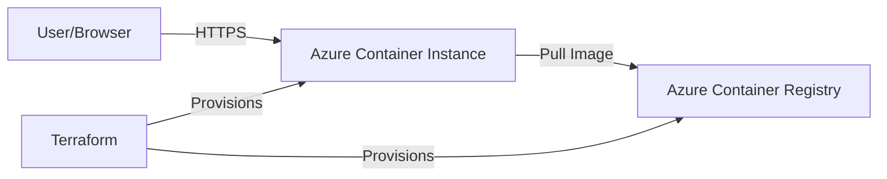

# InsurePrice: Enterprise Car Insurance Risk Modeling & Pricing Platform

<div align="center">


**Complete End-to-End Insurance Technology Platform**

*Production-ready ML-powered risk assessment, actuarial pricing, fraud detection, and portfolio optimization.*
*Featuring new **GenAI & IoT Prototypes** for 2026.*

[Quick Start](#quick-start) • [API Docs](#rest-api) • [Fraud Detection](#fraud-detection) • [Next-Gen Prototypes](#next-gen-prototypes-new)

</div>

---

## Table of Contents

- [Overview](#overview)
- [Key Features](#key-features)
- [Next-Gen Prototypes (New)](#next-gen-prototypes-new)
- [Quick Start](#quick-start)
- [REST API](#rest-api)
- [Fraud Detection](#fraud-detection)
- [Interactive Dashboard](#interactive-dashboard)
- [Project Structure](#project-structure)
- [Tech Stack](#tech-stack)
- [Business Value](#business-value)
- [Contact](#contact)

---

## Overview

**InsurePrice** is a comprehensive, enterprise-grade car insurance platform that transforms traditional insurance operations through advanced machine learning, actuarial science, and AI-powered analytics.

In **December 2025**, the platform was expanded with three cutting-edge R&D prototypes demonstrating the future of **InsurTech 2.0**: Digital Twins, Peer-to-Peer Communities, and IoT-driven Preventative Maintenance.

### What This Platform Delivers

| Capability | Description | Business Impact |
|------------|-------------|-----------------|
| **Risk Prediction** | ML models predicting claim probability | AUC 0.65+, accurate underwriting |
| **Actuarial Pricing** | Professional premium calculation | £400-£1,200 market-aligned |
| **Fraud Detection** | Real-time claims fraud analysis | £60M potential savings (5% improvement) |
| **Risk Digital Twin** | **[NEW]** Monte Carlo commute simulation | Granular, hyper-personalized risk scoring |
| **P2P Village Pools** | **[NEW]** Community-based insurance | Lower premiums, cashback dividends |
| **Preventative Bond** | **[NEW]** IoT-triggered repair payments | Accident prevention vs. claims processing |

---

## Key Features

### Machine Learning Risk Models
- **CatBoost**: Best performer with categorical embeddings (AUC 0.6176) - WINNER
- **Random Forest**: Optimized with hyperparameter tuning (AUC 0.6074)
- **Neural Network Ensemble**: Deep learning with embedding layers
- **Feature Engineering**: +3.84% AUC improvement with interaction terms

### Actuarial Pricing Engine
- Professional premium calculation formulas
- Risk-based pricing with 17+ factors
- NCD (No Claims Discount) integration
- Voluntary excess adjustments

### Real-Time Fraud Detection
- **Anomaly Detection**: Isolation Forest for unusual patterns
- **NLP Analysis**: 40+ fraud indicator keywords
- **Network Analysis**: Fraud ring identification

---

## Next-Gen Prototypes (New)

Added in **v2.1 (Dec 2025)**, these experimental features showcase the future of insurance:

### 1. Risk Twin Simulator
*A "Digital Twin" of the driver that simulates their daily commute 10,000 times.*
- **Methodology**: Monte Carlo Simulation.
- **Data Source**: Uses real historical UK weather/traffic data (`UK_Driving_Conditions_2025.csv`).
- **Value**: Instead of guessing risk, we *simulate* it based on exact route, driver fatigue, and environmental conditions.

### 2. Peer-to-Peer "Village" Pools
*Why pay for bad drivers? Join a "Village" of similar people.*
- **Logic**: Assigns users to micro-communities (e.g., "Night Owls", "Safe Commuters") based on telemetry.
- **Smart Contract**: Automates "End of Month" reconciliation. If Claims < Premiums, the Surplus is paid back as a **Dividend**.
- **Data**: Built on a synthetic population of **50,000 users** (`The_Village_Population.csv`).

### 3. Preventative Maintenance Bond
*Insurance that pays you to fix your car BEFORE you crash.*
- **Concept**: Parametric insurance linked to IoT Telematics.
- **Mechanism**: Monitors Brake Wear (%) and Tyre Tread (mm).
- **Trigger**: If `Risk > 80%`, the policy **automatically credits £250** for immediate repairs at a partner garage.
- **Goal**: Cheaper to pay £250 for tyres than £15,000 for a hydroplaning accident.

### 4. Carbon-to-Credit Gamification
*Drive Green, Mine Crypto.*
- **Concept**: Verifiable eco-driving earns "InsureCoin" tokens.
- **Engine**: Calculates a "Mining Hashrate" based on **Avg RPM** and **Driving Smoothness**.
- **Incentive**: Carbon-negative driving (Tier 1) mines credits that automatically offset your premium bill.
- **Data**: 50,000 synthetic "Driver Eco Profiles" (`Driver_Eco_Profiles.csv`).

---

## Quick Start

### Prerequisites

```bash
# Clone the repository
git clone https://github.com/MichaelTheAnalyst/InsurePrice-Car-Insurance-Risk-Modeling.git
cd InsurePrice-Car-Insurance-Risk-Modeling

# Install dependencies
pip install -r requirements.txt
pip install -r requirements_api.txt
```

### 1. Generate Synthetic Data (Required for Prototypes)
We generate 50,000+ records for the new features:

```bash
# 1. Generate Village Population (50,000 users)
python scripts/generate_village_population.py

# 2. Generate Weather/Traffic History (365 days)
python scripts/generate_weather_traffic.py

# 3. Generate IoT Maintenance Records (Tyres/Brakes)
python scripts/generate_maintenance_data.py

# 4. Generate Eco-Driving Profiles (RPM/Smoothness)
python scripts/generate_eco_data.py
```

### 2. Launch Dashboard
Access the full platform including the new prototypes:

```bash
streamlit run insureprice_dashboard.py
```
*Navigate using the Sidebar to access "Risk Twin", "Village Pools", etc.*

---

---

## Cloud Architecture & Deployment

**InsurePrice** is designed as a cloud-native application, leveraging modern **DevOps** principles and **Infrastructure as Code (IaC)**.

### Technology Stack
- **Terraform**: Manages Azure infrastructure (IaC)
- **Docker**: Containerizes the application for consistent deployment
- **Azure Container Instances (ACI)**: Serverless container execution
- **Azure Container Registry (ACR)**: Secure Docker image storage

### Infrastructure Diagram


### Deployment Commands
The project includes a production-ready Terraform configuration for Azure.

```bash
# Login to Azure
az login

# Initialize Terraform
terraform -chdir=terraform init

# Plan Infrastructure
terraform -chdir=terraform plan

# Deploy to Azure
terraform -chdir=terraform apply
```

---

## Interactive Dashboard

### Pages Overview
1.  **Dashboard**: Main portfolio overview.
2.  **Risk Assessment**: Classic actuarial pricing.
3.  **Customer CLV**: Lifetime value prediction.
4.  **Fraud Detection**: AI Claims analysis.
5.  **Portfolio Analytics**: Deep dive stats.
6.  **Model Performance**: ML Metrics.
7.  **Risk Twin**: (New) Commute Simulator.
8.  **Village Pools**: (New) P2P Insurance.
9.  **Preventative Bond**: (New) IoT Maintenance.
10. **Eco-Credits**: (New) Crypto Mining Gamification.

---

## Project Structure

```
InsurePrice/
├── Data & Models
│   ├── data/The_Village_Population.csv          # [NEW] 50k User profiles
│   ├── data/Vehicle_Maintenance_Records.csv     # [NEW] IoT Health data
│   ├── data/Driver_Eco_Profiles.csv             # [NEW] Eco-Driving stats
│   ├── data/UK_Driving_Conditions_2025.csv      # [NEW] Environmental data
│   └── ...
│
├── Next-Gen Prototypes [NEW]
│   ├── src/simulation/digital_twin.py           # Monte Carlo Engine
│   ├── src/p2p/community_pool.py                # Village Logic
│   ├── src/maintenance/bond_engine.py           # IoT Bond Logic
│   ├── src/gamification/carbon_engine.py        # Carbon Mining Logic
│   └── pages/                                   # Streamlit Independent Pages
│       ├── 1_Risk_Twin.py
│       ├── 2_Village_Pools.py
│       ├── 3_Preventative_Bond.py
│       └── 4_Eco_Credits.py
│
├── Pricing Engine
│   ├── pricing_engine.py                        # Main pricing engine
│   └── ...
│
├── Fraud Detection
│   ├── fraud_detection.py                       # Core fraud engine
│   └── ...
│
├── Scripts [NEW]
│   ├── generate_village_population.py
│   ├── generate_weather_traffic.py
│   ├── generate_maintenance_data.py
│   └── generate_eco_data.py
│
└── Dashboard
    └── insureprice_dashboard.py                 # Main App Entry point
```

---

## Tech Stack

| Category | Technology |
|----------|------------|
| **Core** | Python 3.8+, Streamlit, FastAPI |
| **ML/AI** | scikit-learn, XGBoost, CatBoost, SHAP |
| **New Prototypes** | **Monte Carlo Simulation**, **Rule-Based Smart Contracts** |
| **Visualization** | Plotly (Interactive Gauges, Maps), Matplotlib |
| **Data** | pandas, NumPy (Vectorized operations) |

---

## Contributing

1. Fork the repository
2. Create feature branch (`git checkout -b feature/amazing-feature`)
3. Commit changes (`git commit -m 'Add amazing feature'`)
4. Push to branch (`git push origin feature/amazing-feature`)
5. Open a Pull Request

---

## Contact

<div align="center">

**Masood Nazari**  
**Business Intelligence Analyst | Data Science | AI | Clinical Research**

[](mailto:M.Nazari@soton.ac.uk)
[](https://michaeltheanalyst.github.io/)
[](https://linkedin.com/in/masood-nazari)
[](https://github.com/michaeltheanalyst)

</div>

---

## License
This project is licensed under the MIT License - see the [LICENSE](LICENSE) file for details.

<div align="center">
**InsurePrice v2.1** - *Innovating Insurance with AI*
</div>
